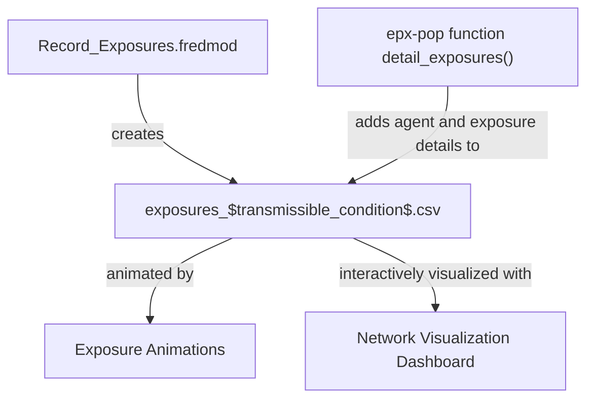

# Network-Visualization-Dashboard
Visualize FRED Transmission Networks



Using Record_Exposures.fredmod example

```
use Record_Exposure_Simple {
    transmissible_condition = INFLUENZA  # the transmissible condition
    exposure_state = Exposed  # its exposed_state
}
```

At simulation:
- Add an instance of the `Record_Exposures` module with your transmissible condition and your exposed state to you FRED simulation.
  - This adds a set_state() command to your transmissible condition's exposed state to write an exposure to a csv file and adds a unique `RECORD_EXPOSURES` condition for your transmissible condition.
  - Output of `RECORD_EXPOSURES` is `exposures_$transmissible_condition$.csv`

After simulation:
- Use `epx-pop` package function or `detail_agents.py` script to add human-readable details to csv file from Record_Exposures module
- Call Network Visualization Dashboard with `python network_dashboard.py your_detailed_csv.csv`
